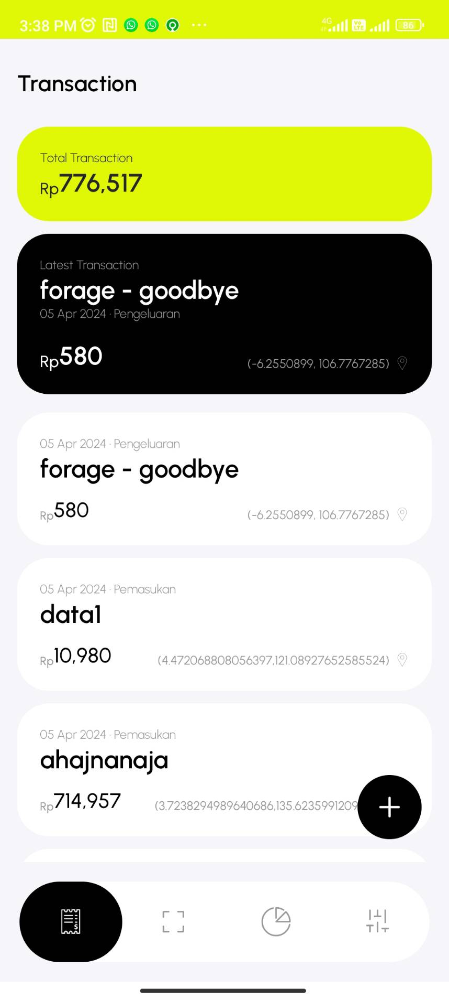
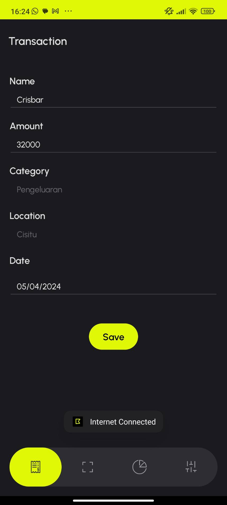
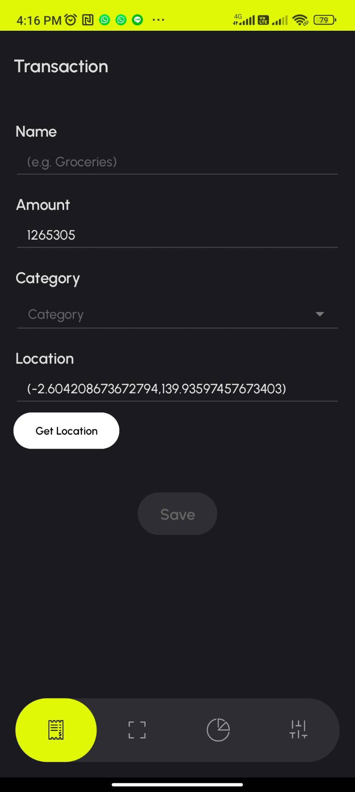
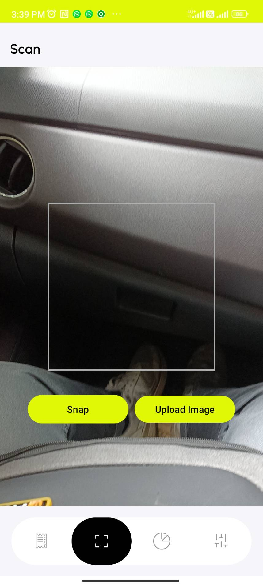
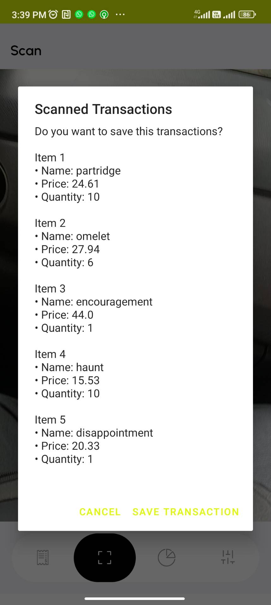
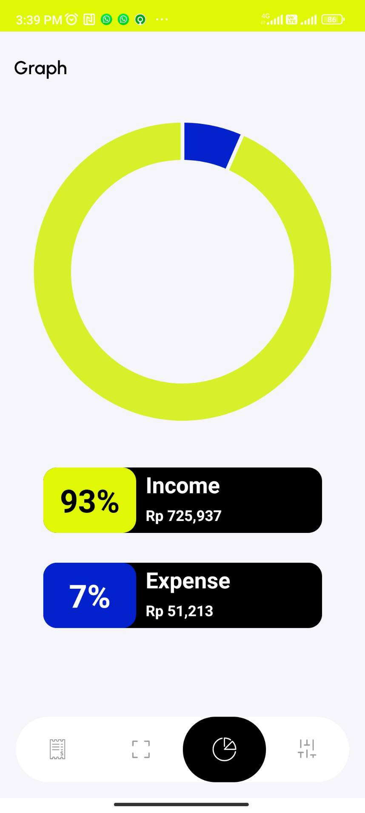
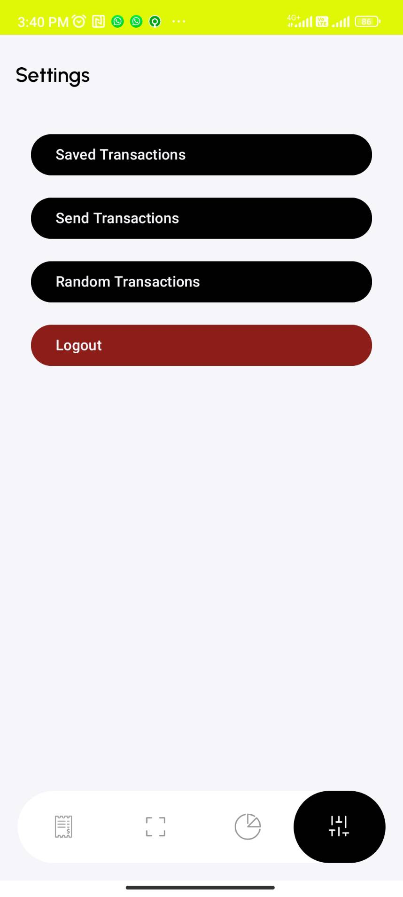
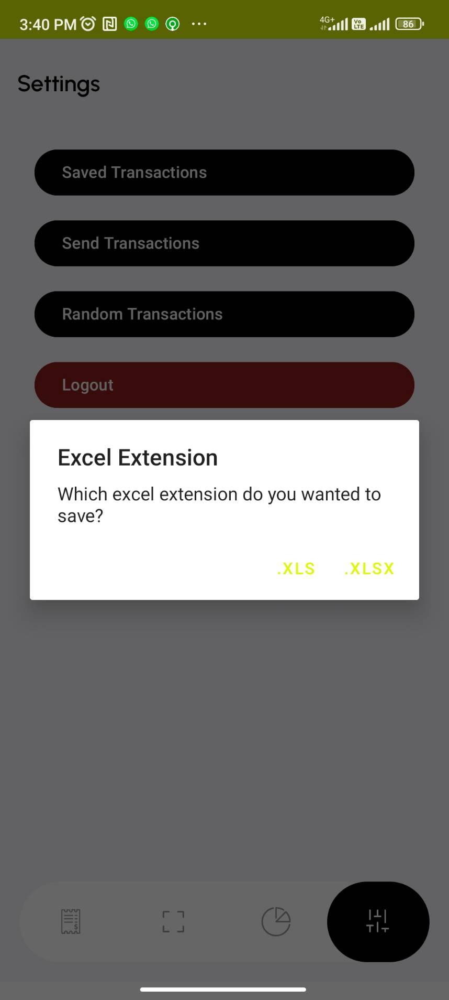
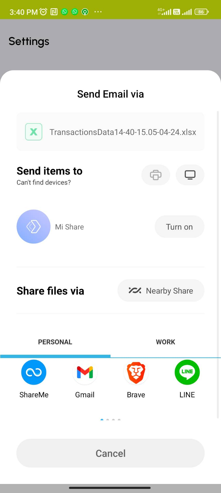
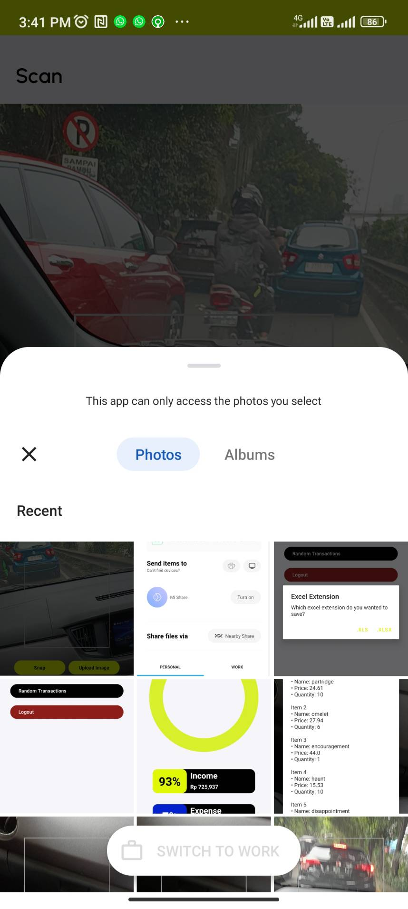

# Transaction Management Android App

## Deskripsi Aplikasi

Aplikasi Manajer Keuangan merupakan sebuah aplikasi yang dirancang untuk membantu pengguna dalam
mengelola keuangan pribadi mereka. Dengan aplikasi ini, pengguna dapat mencatat transaksi keuangan,
melihat rangkuman transaksi, melakukan scan nota, serta menyimpan daftar transaksi dalam format
spreadsheet. Aplikasi juga menyediakan fitur untuk mengirimkan daftar transaksi melalui email dan
mengelola pengaturan akun. Fitur utama aplikasi adalah sebagai berikut.

### Login dan Logout

Pengguna harus login terlebih dahulu sebelum dapat menggunakan fitur###fitur aplikasi. Setelah
login, pengguna akan mendapatkan token yang digunakan untuk mengakses fitur lainnya. Logout dapat
dilakukan di halaman pengaturan.

### Manajemen Transaksi

Pengguna dapat menambahkan, mengubah, dan menghapus transaksi. Data transaksi disimpan secara lokal
menggunakan Room Persistence Library.

### Melihat Daftar Transaksi

Halaman ini menampilkan daftar transaksi yang telah dilakukan oleh pengguna. Setiap transaksi
mencakup informasi seperti kategori, nominal, nama, lokasi, dan tanggal transaksi.

### Scan Nota

Pengguna dapat melakukan scan nota untuk menambahkan transaksi baru. Gambar nota dikirim ke server
untuk diproses.

### Grafik Rangkuman Transaksi

Pengguna dapat melihat grafik yang memvisualisasikan rangkuman transaksi yang telah dilakukan.

### Ekspor Transaksi

Pengguna dapat menyimpan daftar transaksi dalam format spreadsheet (xlsx atau xls) yang dapat
diunduh dan dibuka di luar aplikasi.

### Mengirim Transaksi via Email

Pengguna dapat mengirimkan daftar transaksi melalui email sebagai lampiran berkas spreadsheet.

### Background Service

Aplikasi memiliki background service untuk memeriksa expiry JWT (JSON Web Token).

### Network Sensing

Aplikasi dapat mendeteksi koneksi internet dan memberikan notifikasi jika tidak terhubung.

### Broadcast Receiver

Terdapat broadcast receiver untuk menerima intent dari tombol "Randomize transaksi" di halaman
pengaturan.

## Library yang Digunakan

- Room Persistence Library
- ViewModel and LiveData
- Retrofit for REST API calls
- Gson for JSON serialization
- Google Play Services Location
- MPAndroidChart for grafik visualisasi

## Screenshot Aplikasi

### Splash Screen

### Login Screen

### Login as Guest Screen

### Transaction List Screen

### New Transaction Screen

### Update Transaction Screen

### Random Transaction Screen

### Scan Screen

### Scan Result Screen

### Graph Screen

### Settings Screen

### Export Dialog

### Email Dialog

### Gallery

## Pembagian Kerja

| NIM      | Nama                    | Pembagian Tugas                                                                       |
 |----------|-------------------------|---------------------------------------------------------------------------------------|
| 13521121 | Saddam Annais Shaquille | Scan, Upload Image, Graph, generate excel, settings UI                                |
| 13521146 | Muhammad Zaki Amanullah | Transaction, New Transaction, Location, DAO, Room, Randomize Broadcast, Theme         |
| 13521109 | Rizky Abdillah Rasyid   | Login, Network Sensing, Background Service, Send Email, API Client, SharedPreferences |
| 10023510 | M. Teguh Wijaksono      | Logout                                                                                |

## Alokasi Waktu

| NIM      | Nama                    | Persiapan (jam) | Pengerjaan (jam) |
 |----------|-------------------------|-----------------|------------------|
| 13521121 | Saddam Annais Shaquille | 10              | 60               |
| 13521146 | Muhammad Zaki Amanullah | 10              | 60               |
| 13521109 | Rizky Abdillah Rasyid   | 10              | 60               |
| 10023510 | M. Teguh Wijaksono      | 2               | 10               |